## Ansible tower

### Logon to ansible tower with admin
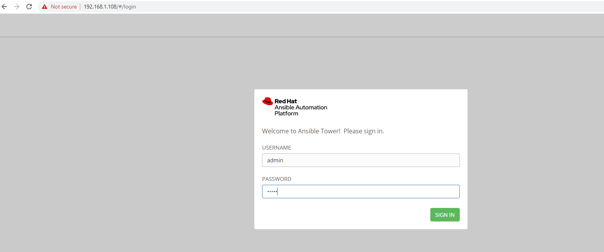

### Create Credentials for gihtub token. The credentials involved in Ansible tower and github communication
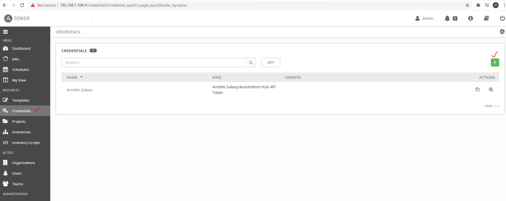

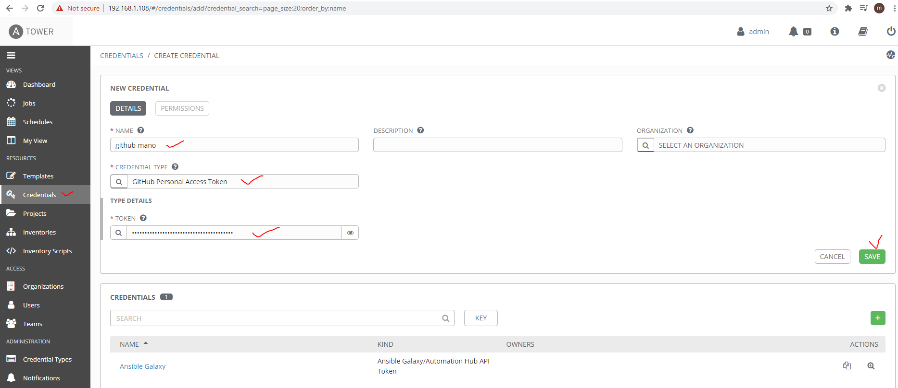

### Create Credentials for SSH login. The credentials involved in Ansible tower and target servers communication
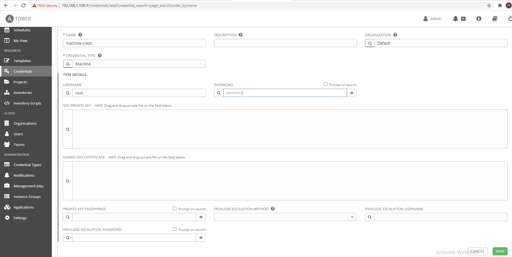

### Creating a project
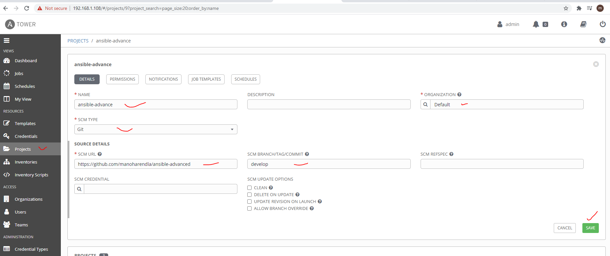

### Creating an inventory
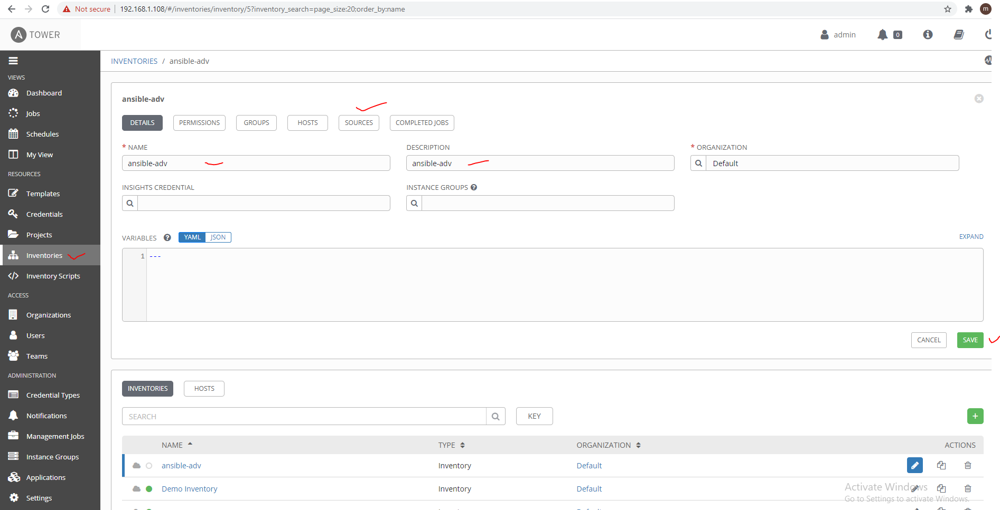

### Creating an inventory source to find the inventory yaml
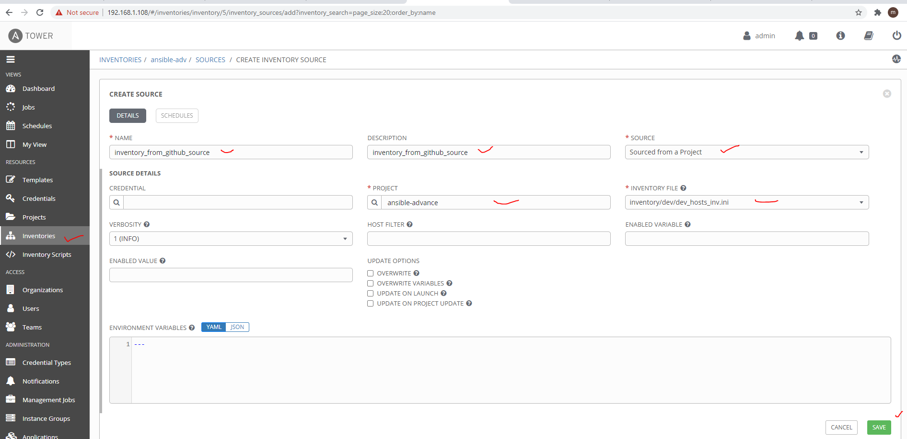

### Run sync to fetch the host and groups from inventory yaml
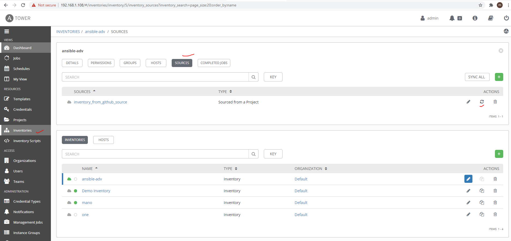
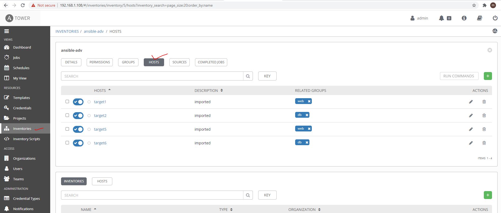

### Create a job template
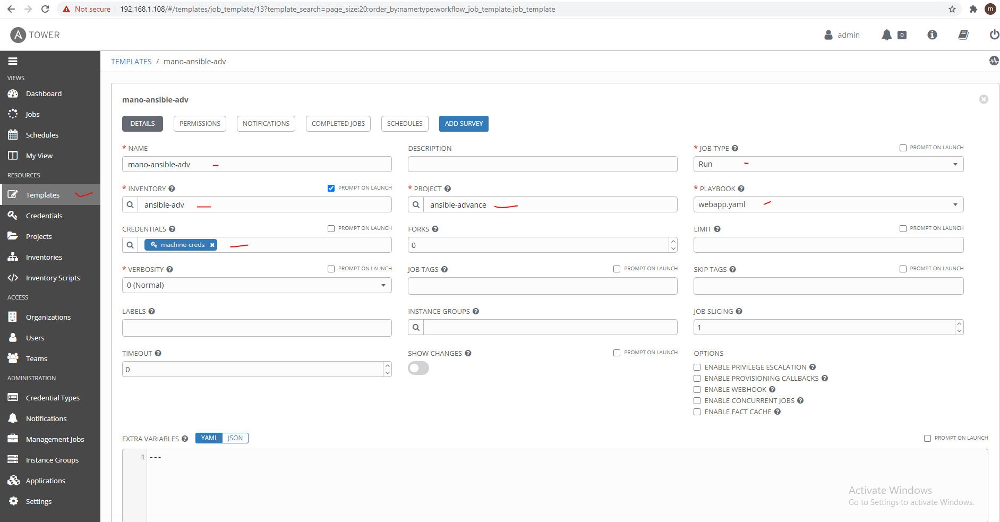

### Scheduling and Notifications Options
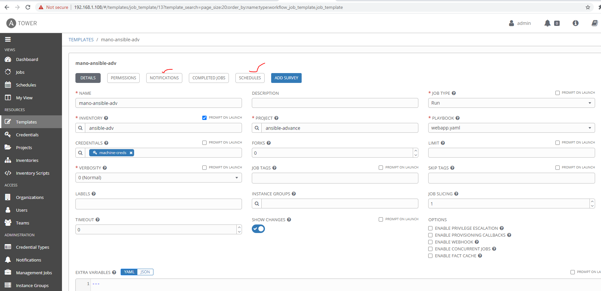

### Launch job
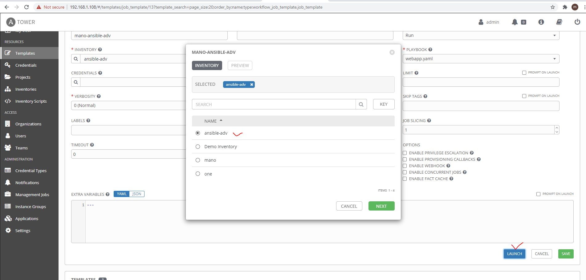

